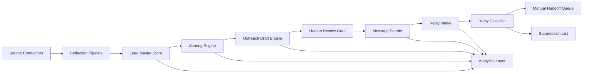

# System Architecture (v1)

## Purpose
This file is the technical blueprint of your lead engine. In simple terms, it tells you which parts to build, what each part does, and how data moves from discovery to replies.

## Scope
1. First-touch outreach only.
2. No automated follow-up generation.
3. Manual founder/team handoff after reply.

## System goals
1. Discover relevant early-stage D2C brands.
2. Score and prioritize leads consistently.
3. Generate personalized first-touch drafts.
4. Track replies, suppress opt-outs, and log outcomes.
5. Produce analytics for continuous improvement.

## High-level architecture

## Core modules

### 1) Source Connectors
Purpose: Collect raw public business-relevant data from allowed platforms.
Inputs: Search keywords and platform rules from source discovery plan.
Outputs: Raw candidate records with evidence URLs.
Primary responsibilities:
1. Platform-specific fetch/parsing.
2. Source metadata tagging (`source_platform`, `collected_at`).
3. Basic schema normalization.

### 2) Collection Pipeline
Purpose: Convert raw candidates into structured lead records.
Inputs:
1. Raw connector output.
2. `lead-data-schema.md`.
Outputs:
1. `raw_discovered_leads`
2. `qualified_leads_ready_for_scoring`
3. `skipped_leads`
Primary responsibilities:
1. Enrichment.
2. Dedup and merge.
3. Qualification gate checks.
4. Unknown-field handling.

### 3) Lead Master Store
Purpose: Single source of truth for all lead records and state.
Inputs:
1. Collection pipeline updates.
2. Scoring and outreach status updates.
Outputs: Queryable lead records for downstream modules.
Primary responsibilities:
1. Canonical `lead_id` handling.
2. Versioned updates.
3. Audit fields (`created_at`, `updated_at`, `last_verified_at`).

### 4) Scoring Engine
Purpose: Apply deterministic rules and produce `A/B/skip` priority.
Inputs:
1. `qualified_leads_ready_for_scoring`.
2. `lead-scoring-spec.md`.
Outputs:
1. `scored_leads`
2. `skipped_scoring`
3. `scoring_run_summary`
Primary responsibilities:
1. Hard-skip checks.
2. Dimension scoring.
3. Penalty application.
4. Reason logging.

### 5) Outreach Draft Engine
Purpose: Generate first-touch message drafts only.
Inputs:
1. Scored leads (`A` and `B`).
2. `message-template-bank.md`.
3. `outreach-workflow.md`.
Outputs: Draft payloads ready for review.
Primary responsibilities:
1. Template selection.
2. Signal-grounded personalization.
3. Channel selection.
4. Claim-safety checks.

### 6) Human Review Gate
Purpose: Ensure no draft is sent without manual approval.
Inputs: Draft payloads.
Outputs: `approved` or `rejected` decision.
Primary responsibilities:
1. Relevance check.
2. Tone and policy check.
3. CTA clarity check.

### 7) Message Sender
Purpose: Send approved first-touch messages on selected channels.
Inputs: Approved draft payloads.
Outputs: Delivery/send log entries.
Primary responsibilities:
1. Channel adapter routing.
2. Delivery status recording.
3. Idempotent send protection.

### 8) Reply Intake and Classifier
Purpose: Capture inbound replies and route them by intent.
Inputs:
1. Reply payloads from channels.
2. `reply-handling-workflow.md`.
Outputs:
1. `reply_log`
2. `manual_handoff_queue`
3. `suppression_list` updates
Primary responsibilities:
1. Reply-type classification.
2. Action mapping.
3. Manual handoff creation.

### 9) Suppression Manager
Purpose: Prevent future outreach to opt-out contacts.
Inputs: Opt-out replies.
Outputs: Updated suppression store and send-time block decisions.
Primary responsibilities:
1. Maintain do-not-contact registry.
2. Block sends pre-dispatch.
3. Keep audit reason and timestamp.

### 10) Analytics Layer
Purpose: Track funnel, quality, and message performance.
Inputs: Events from collection, scoring, outreach, and replies.
Outputs: Daily and weekly reports.
Primary responsibilities:
1. Metrics calculation.
2. Breakdown views.
3. First-touch constraint checks.

## Data stores (logical design)

### 1) `lead_master`
Stores:
1. Canonical lead fields from schema.
2. Current status flags.
3. Last known score and bucket.

### 2) `lead_evidence`
Stores:
1. `lead_id`
2. `source_urls`
3. Evidence notes
4. Collection timestamps

### 3) `scoring_results`
Stores:
1. Per-run score breakdown.
2. Penalties and reasons.
3. Final bucket.

### 4) `outreach_messages`
Stores:
1. Draft and approved message payloads.
2. Channel and send status.
3. Message timestamps.

### 5) `reply_log`
Stores:
1. Inbound reply text and metadata.
2. Classification outputs.
3. Action outcome.

### 6) `suppression_list`
Stores:
1. Contact identifier (email/IG/WhatsApp).
2. Suppression reason.
3. Created timestamp.

### 7) `metrics_snapshots`
Stores:
1. Daily aggregate metrics.
2. Weekly review aggregates.
3. Data quality indicators.

## Event flow (state transitions)
1. `discovered` -> `qualified` or `skipped`
2. `qualified` -> `scored_a` or `scored_b` or `skipped_scoring`
3. `scored_*` -> `draft_ready`
4. `draft_ready` -> `approved` or `rejected`
5. `approved` -> `sent`
6. `sent` -> `replied` or `closed`
7. `replied` -> `manual_handoff_required` or `closed` or `suppressed`

## Contracts between modules

### Contract A: Collection -> Scoring
Required fields:
1. All required scoring inputs from `lead-scoring-spec.md`
2. At least one direct channel
3. Evidence URLs

### Contract B: Scoring -> Outreach
Required fields:
1. `lead_id`
2. `priority_bucket` (`A` or `B`)
3. Score reason summary
4. Channel availability fields

### Contract C: Outreach -> Reply Handling
Required fields:
1. Outbound message id
2. `lead_id`
3. Channel and sent timestamp
4. Sender identity

## Reliability and safety controls
1. Idempotency keys for send operations.
2. Dedup before scoring and before sending.
3. Pre-send suppression check is mandatory.
4. Unknown values must be explicit (`unknown`), never guessed.
5. Full audit trail for scoring and message decisions.

## Error handling strategy
1. Connector failures:
   - retry with backoff, then mark source as partial.
2. Schema validation failures:
   - route to `data_quality_queue`.
3. Send failures:
   - mark as `send_failed` and require manual retry.
4. Reply parse/classification failures:
   - label as `unclear` and route to manual review.

## Security and compliance baseline
1. Store minimal required data only.
2. Do not store sensitive personal data beyond business contact needs.
3. Respect platform terms and opt-out handling.
4. Restrict access to suppression list and raw message logs.

## Suggested implementation order
1. Lead Master Store + schema validators.
2. Collection pipeline (manual/semi-automated).
3. Scoring engine.
4. Outreach draft engine + review gate.
5. Message sender adapters.
6. Reply intake/classifier + suppression manager.
7. Analytics aggregation jobs.

## Non-goals in v1
1. No autonomous multi-step conversation agent.
2. No auto-follow-up campaigns.
3. No complex ML ranking beyond rule-based scoring.
4. No cross-region legal automation.

## Completion checklist
1. Every module has a clear input/output contract.
2. Data model aligns with `lead-data-schema.md`.
3. First-touch-only constraint is enforced.
4. Suppression checks are enforced before send.
5. End-to-end flow can process one lead from discovery to reply log.
